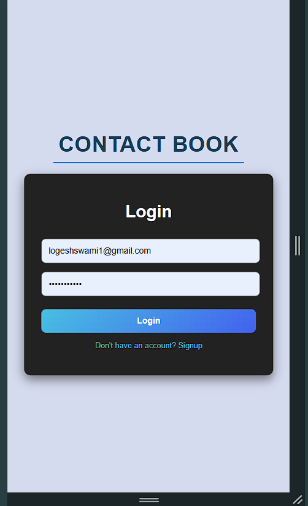

# Contact App  

A full-stack contact management application with login and signup functionality, built using **React** for the frontend, **Go Gin** for the backend, and **PostgreSQL** for the database. The app is containerized and orchestrated using **Docker Compose**.

---

## Features  

- **User Authentication**: Login and signup functionality for users.  
- **CRUD Operations**: Users can create, read, update, and delete contact data.  
- **Responsive Design**: Optimized for both desktop and mobile views.  
- **Containerized Deployment**: Dockerized services for easy setup and scalability.

---

## Technologies  

### Frontend  
- **React**  

### Backend  
- **Go Gin Framework**  
- **GORM** (ORM for Go)  
- **Google UUID**  
- **Crypto** (for hashing password) 
- **PostgreSQL Driver**  

### Database  
- **PostgreSQL**  

### Containerization  
- **Docker**  
- **Docker Compose**  

---

## Schemas  

### User  
```go
type User struct {
    UserId       string `gorm:"primary_key;not null;unique;type:uuid"`
    Email        string `gorm:"unique;not null"`
    PasswordHash string `gorm:"column:password_hash;not null"`
    Name         string `gorm:"not null"`
}
```

### Contact  
```go
type Contact struct {
    ContactId string `gorm:"primaryKey;not null;unique;type:uuid"`
    UserId    string `gorm:"not null;type:uuid;uniqueIndex:idx_name_user;uniqueIndex:idx_phone_user"`
    User      User   // Foreign key relationship
    Name      string `gorm:"not null;uniqueIndex:idx_name_user"`
    Phone     string `gorm:"not null;uniqueIndex:idx_phone_user"`
    Email     string
    Address   string
}
```

---

## API Routes  

### Authentication  
- **`POST /signup`**: Register a new user.  
- **`POST /login`**: Login with existing user credentials.  

### Contacts  
- **`POST /contacts/add`**: Add a new contact.  
- **`POST /contacts/fetch`**: Retrieve all contacts for a user.  
- **`PUT /contacts/:contact_id`**: Update contact details.  
- **`DELETE /contacts/:contact_id`**: Delete a contact.  

---

## Screenshots  

### Login Page & Signup 

| Login                               | Signup                              |  
|-------------------------------------------|-------------------------------------------|  
|  |  | 

### Home Page

| Mobile View                              | Desktop View                              |  
|-------------------------------------------|-------------------------------------------|  
|  |  |  


### View Contact 

| Mobile View                               | Desktop View                              |  
|-------------------------------------------|-------------------------------------------|  
|  |  |  

---

### Add Contact

                               
 
    


## Docker Setup  

### Prerequisites  

- Install [Docker](https://www.docker.com/)  
- Install [Docker Compose](https://docs.docker.com/compose/)  

### Steps  

1. Clone the repository:  
   ```bash
   git clone https://github.com/logeshswami/Contact-app.git
   cd contact-app
   ```

2. Start the services:  
   ```bash
   docker-compose up --build
   ```

3. Access the application:  
   - Frontend: [http://localhost:4173](http://localhost:4173)  
   - Backend: [http://localhost:8080](http://localhost:8080)  

---

## Docker Compose Configuration  

### `docker-compose.yml`  

```yaml
version: '3.9'

services:
  contact_db:
    image: postgres:15
    container_name: contact_db
    environment:
      POSTGRES_USER: contactuser
      POSTGRES_PASSWORD: 1243
      POSTGRES_DB: contactdb
    ports:
      - "5432:5432"
    volumes:
      - contact_db_data:/var/lib/postgresql/data
    restart: unless-stopped

  backend:
    build:
      context: ./backend
      dockerfile: Dockerfile
    container_name: contact_backend
    ports:
      - "8080:8080"
    env_file:
      - ./backend/.env.txt
    depends_on:
      - contact_db
    restart: unless-stopped

  frontend:
    build:
      context: ./frontend
      dockerfile: Dockerfile
    container_name: contact_frontend
    ports:
      - "4173:4173"
    depends_on:
      - backend
    restart: unless-stopped

volumes:
  contact_db_data:
    driver: local
```

---

## Demo  

Watch the live demo here: [Demo Video Link](https://drive.google.com/file/d/1bJVZpxpDSHV5MktZDkN3RRlKvB_f1OmP/view?usp=sharing)  

---

## License  

© 2024 LogeshS  
